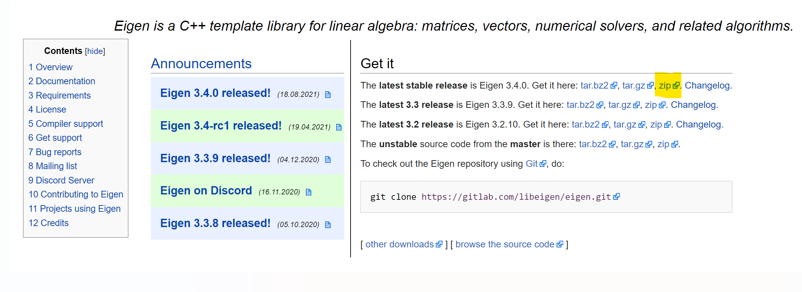
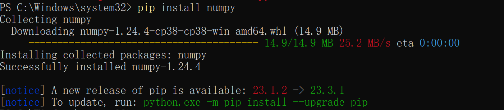

# Trajectory-Planning
## 任务分配, 参加飞书文档
https://sjtu.feishu.cn/base/KYnZbVJZ7a2aWbsQYLGcgrm4nxh?table=tblyOMmLygKxJnm9&view=vewox8xE5E
在10.25之前将自己的飞书名填写在对应的任务下面
## 自行配置Eigen库&&numpy库
### Eigen
官网:
现在可以直接clone文件夹运行, 但是如果需要自行配置Eigen库, 可以参考以下步骤
https://eigen.tuxfamily.org/index.php?title=Main_Page
点击黄色处下载zip  
https://zhuanlan.zhihu.com/p/507347854 配置教程网上有很多
### numpy
官网:
https://numpy.org/install/  

关闭VPN, 在 **PowerShell** 中输入 `pip install numpy`

## 注意事项
将python转化为C++时, 需要**经常在VEXCode**中检查是否可以通过编译 (VEXCode有潜藏的限制和冲突)
注意在 `#include <Eigen/Dense>` 和 `using namespace Eigen;` 之前, 添加 `#undef __ARM_NEON__` 和 `#undef __ARM_NEON`

